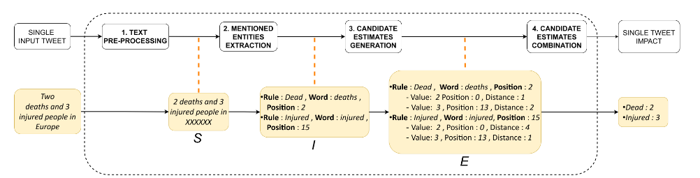
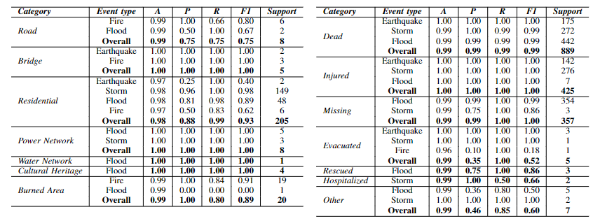
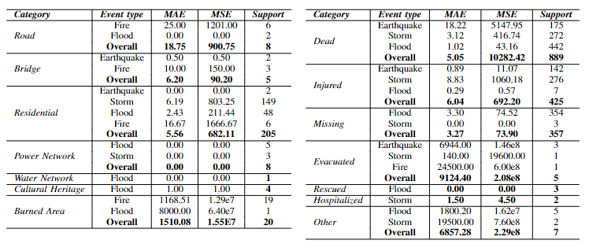

# Impact Estimation of Emergency Events Using Social Media Streams
---
## Note
This is the official repository of the accepted IEEE RTSI 2022 paper *Impact Estimation of Emergency Events Using Social Media Streams*

## Overview



## Setup
In order to use the code in this repository you have tho first install the dependencies and then download the required pipelines.
1. To install the dependencies, a python virtual environment is suggested. After its creation and activation, run
```
pip install -r requirements.txt
```

2. To download text processing pipelines run
```
bash download_pipelines.sh
```

3. To predict estimate for a set of tweets
```
python main.py --in {PATH_TO_INPUT_FILE} --out {PATH_TO_OUTPUT_FILE}
```

4. To evaluate performances on a set of tweets
```
python evaluate.py --pred {PATH_TO_PREDICTION} --gt {PATH_TO_GROUND_TRUTH} --event --overall --out {PATH_Of_OUTPUT_FOLDER}
```

5. To combine predictions of a set of tweets according to disaster event
```
python predict_events.py -in {PATH_TO_INPUT_PREDICTIONS_FILE} --out {PATH_TO_OUTPUT_FILE} --filter
```

## Results
Results of classification of affected entities and estimation of number of affected entities on the provided test set. More details can be found on paper




## Support new language
1. Check on [Spacy](https://spacy.io/usage) whether there is a pre-trained pipeline for the target language. If there is not a dedicated pipeline for target language you could use the multi-language pipeline
2. Modify environment variable SUPPORTED_LANGUAGES = "en,es,it" by adding the name of the new language
3. Add yara_rules to directory.
    Create file {*lan*}_rules.yara in impact, infrastructure and population directories
4. Add unit measures definition in *impact_estimation/utils.py:AREA_UNIT_MEASURE_PATTERN* and *impact_estimation/utils.py:WEIGHT_UNIT_MEASURE_PATTERN*
5. Implement or import *word{lan}2num* method to convert word to number in the target langugage *lan* in *impact_estimation/cardinal_word.py*
6. Add association between target language name and correspondant spacy trained pipeline name in *impact_estimation/constants:spacy_pipeline_map*
7. [Optional] Add instruction to download trained pipeline to *download_pipelines.sh*
## Cite
If you use either the code or data in this repository, please cite the following paper:
```
@inproceedings{,
  author    = {Giacomo Blanco and
               Edoardo Arnaudo and
               Dario Salza and
               Claudio Rossi},
  title     = {Impact Estimation of Emergency Events Using Social Media Streams},
  booktitle = {{RTSI}},
  pages     = {},
  publisher = {{IEEE}},
  year      = {2022}
}
```
## License
This work is licensed under the Creative Commons Attribution-ShareAlike 4.0 International License. To view a copy of this license, visit http://creativecommons.org/licenses/by-sa/4.0/ or send a letter to Creative Commons, PO Box 1866, Mountain View, CA 94042, USA.